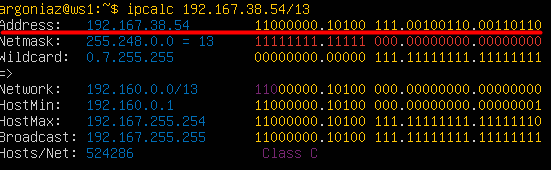
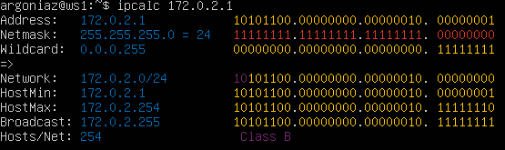
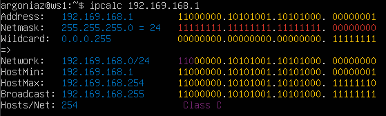
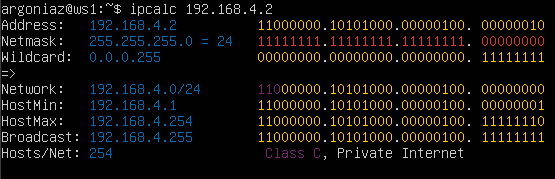
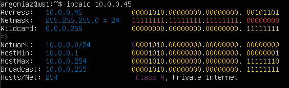
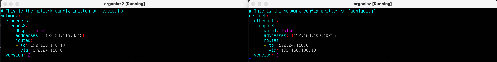
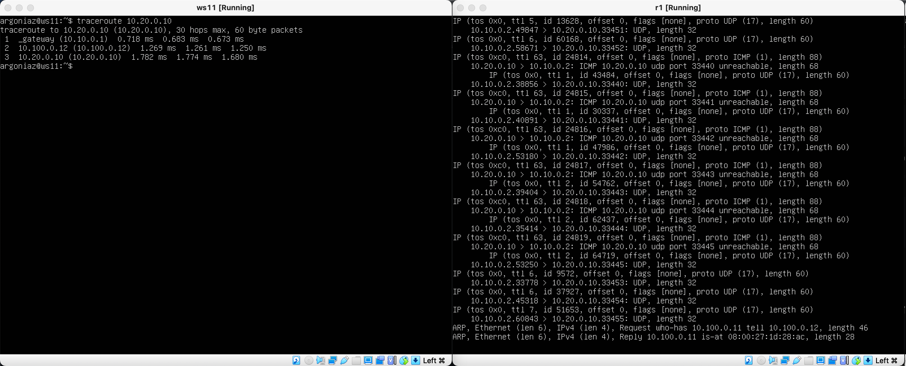
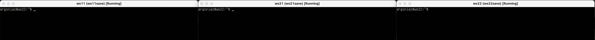

## Part 1. Инструмент **ipcalc**

**== Задание ==**

##### Поднять виртуальную машину (далее -- ws1)

**== Выполнение ==**


```start```

#### 1.1. Сети и маски
##### Определить и записать в отчёт:
##### 1) адрес сети *192.167.38.54/13*
##### 2) перевод маски *255.255.255.0* в префиксную и двоичную запись, */15* в обычную и двоичную, *11111111.11111111.11111111.11110000* в обычную и префиксную
##### 3) минимальный и максимальный хост в сети *12.167.38.4* при масках: */8*, *11111111.11111111.00000000.00000000*, *255.255.254.0* и */4*

**== Выполнение ==**

1)

```ipcalc 192.167.38.54/13```
2)

```ipcalc 255.255.255.0```

```ipcalc /15```

```ipcalc 192.167.38.54/28```
3)

```ipcalc 12.167.38.4/8```

```ipcalc 12.167.38.4/16```

```ipcalc 12.167.38.4/255.255.254.0```

```ipcalc 12.167.38.4/4```

#### 1.2. localhost
##### Определить и записать в отчёт, можно ли обратиться к приложению, работающему на localhost, со следующими IP: *194.34.23.100*, *127.0.0.2*, *127.1.0.1*, *128.0.0.1*

**== Выполнение ==**

* Приложения к которым можно обратиться через localhost: 127.0.0.2, 127.1.0.1:

    ```ipcalc 127.0.0.2```

    ```ipcalc 127.1.0.1```
* Приложения к которым нельзя обратиться через localhost: 194.34.23.100, 128.0.0.1:

    ```ipcalc 194.34.23.100```

    ```ipcalc 128.0.0.1```

#### 1.3. Диапазоны и сегменты сетей
##### Определить и записать в отчёт:
##### 1) какие из перечисленных IP можно использовать в качестве публичного, а какие только в качестве частных: *10.0.0.45*, *134.43.0.2*, *192.168.4.2*, *172.20.250.4*, *172.0.2.1*, *192.172.0.1*, *172.68.0.2*, *172.16.255.255*, *10.10.10.10*, *192.169.168.1*
##### 2) какие из перечисленных IP адресов шлюза возможны у сети *10.10.0.0/18*: *10.0.0.1*, *10.10.0.2*, *10.10.10.10*, *10.10.100.1*, *10.10.1.255*

**== Выполнение ==**

* К публичным относятся следующие IP адреса: 134.43.0.2, 172.0.2.1, 192.172.0.1, 192.169.168.1, 172.68.0.2:

    ```ipcalc 134.43.0.2```

    ```ipcalc 172.0.2.1```

    ```ipcalc 192.172.0.1```

    ```ipcalc 192.169.168.1```

    ```ipcalc 172.68.0.2```

* К частным относятся следующие IP адреса: 10.10.10.10, 172.20.250.4, 172.16.255.255, 192.168.4.2, 10.0.0.45:

    ```ipcalc 10.10.10.10```

    ```ipcalc 172.20.250.4```

    ```ipcalc 172.16.255.255```

    ```ipcalc 192.168.4.2```

    ```ipcalc 10.0.0.45```

* Следующие IP адреса шлюза возможны у сети 10.10.0.0/18: 10.10.0.2, 10.10.10.10, 10.10.1.255

    ```ipcalc 10.10.0.0/18```


## Part 2. Статическая маршрутизация между двумя машинами

**== Задание ==**

##### Поднять две виртуальные машины (далее -- ws1 и ws2)
##### С помощью команды `ip a` посмотреть существующие сетевые интерфейсы

**== Выполнение ==**


    ```ip a```

##### Описать сетевой интерфейс, соответствующий внутренней сети, на обеих машинах и задать следующие адреса и маски: ws1 - *192.168.100.10*, маска */16*, ws2 - *172.24.116.8*, маска */12*

**== Выполнение ==**


    ```sudo vim /etc/netplan/00-installer-config.yaml```

    ```cat /etc/netplan/00-installer-config.yaml```

##### Выполнить команду `netplan apply` для перезапуска сервиса сети

**== Выполнение ==**


    ```sudo netplan apply```

#### 2.1. Добавление статического маршрута вручную
##### Добавить статический маршрут от одной машины до другой и обратно при помощи команды вида `ip r add`

**== Выполнение ==**


    ```sudo ip r add *.*.*.* dev enp0s3```

##### Пропинговать соединение между машинами

**== Выполнение ==**


    ```ping *.*.*.* -c 3```


#### 2.2. Добавление статического маршрута с сохранением

##### Перезапустить машины

**== Выполнение ==**


    ```reboot```

##### Добавить статический маршрут от одной машины до другой с помощью файла *etc/netplan/00-installer-config.yaml*

**== Выполнение ==**


    ```sudo vim /etc/netplan/00-installer-config.yaml```

##### Пропинговать соединение между машинами

**== Выполнение ==**


    ```ping *.*.*.* -c 3```

## Part 3. Утилита **iperf3**

**== Задание ==**

#### 3.1. Скорость соединения
##### Перевести и записать в отчёт: 8 Mbps в MB/s, 100 MB/s в Kbps, 1 Gbps в Mbps

**== Выполнение ==**

8 Mbps = 1 MB/s, 100 MB/s = 819200 Kbps, 1 Gbps = 1024 Mbps

#### 3.2. Утилита **iperf3**
##### Измерить скорость соединения между ws1 и ws2

**== Выполнение ==**


```iperf3 -s```

```iperf3 -c *.*.*.* -p 5201```

## Part 4. Сетевой экран

**== Задание ==**

#### 4.1. Утилита **iptables**
##### Создать файл */etc/firewall.sh*, имитирующий фаерволл, на ws1 и ws2:

##### Нужно добавить в файл подряд следующие правила:
##### 1) на ws1 применить стратегию когда в начале пишется запрещающее правило, а в конце пишется разрешающее правило (это касается пунктов 4 и 5)
##### 2) на ws2 применить стратегию когда в начале пишется разрешающее правило, а в конце пишется запрещающее правило (это касается пунктов 4 и 5)
##### 3) открыть на машинах доступ для порта 22 (ssh) и порта 80 (http)
##### 4) запретить *echo reply* (машина не должна "пинговаться”, т.е. должна быть блокировка на OUTPUT)
##### 5) разрешить *echo reply* (машина должна "пинговаться")

**== Выполнение ==**


```sudo vim /etc/firewall.sh```

##### Запустить файлы на обеих машинах командами `chmod +x /etc/firewall.sh` и `/etc/firewall.sh`

**== Выполнение ==**

```sudo chmod +x /etc/firewall.sh```

```sudo /etc/firewall.sh```

 Стратегия "запретить все, что не разрешено"(ws1): В этой стратегии сначала определяются правила, которые блокируют все входящие или исходящие соединения по умолчанию, за исключением тех, которые были явно разрешены. Затем добавляются правила разрешения, которые позволяют доступ к нужным портам или сервисам. Эта стратегия обеспечивает высокий уровень безопасности, поскольку все соединения блокируются, если они не были явно разрешены.

 Стратегия "разрешить все, что не запрещено"(ws2): В этой стратегии сначала определяются правила разрешения, которые позволяют доступ к нужным портам или сервисам. Затем добавляются правила запрещения, которые блокируют все соединения, которые не были явно разрешены. Эта стратегия обеспечивает высокую доступность сервисов, поскольку все соединения разрешены, если они не были явно запрещены.

#### 4.2. Утилита **nmap**
##### Командой **ping** найти машину, которая не "пингуется", после чего утилитой **nmap** показать, что хост машины запущен

**== Выполнение ==**


```ping -c 5 *.*.*.* ```

```nmap *.*.*.*```

##### Сохранить дампы образов виртуальных машин

**== Выполнение ==**


## Part 5. Статическая маршрутизация сети

**== Задание ==**

##### Поднять пять виртуальных машин (3 рабочие станции (ws11, ws21, ws22) и 2 роутера (r1, r2))

**== Выполнение ==**


#### 5.1. Настройка адресов машин
##### Настроить конфигурации машин в *etc/netplan/00-installer-config.yaml* согласно сети на рисунке.

**== Выполнение ==**


    ```sudo vim /etc/netplan/00-installer-config.yaml```

##### Перезапустить сервис сети. Если ошибок нет, то командой `ip -4 a` проверить, что адрес машины задан верно. Также пропинговать ws22 с ws21. Аналогично пропинговать r1 с ws11.

**== Выполнение ==**


    ```sudo netplan apply```
    ```ip -4 a```
    ```ping *.*.*.* -c 3```

#### 5.2. Включение переадресации IP-адресов.
##### Для включения переадресации IP, выполните команду на роутерах:

**== Выполнение ==**


```sudo sysctl -w net.ipv4.ip_forward=1```

##### Откройте файл */etc/sysctl.conf* и добавьте в него следующую строку:
`net.ipv4.ip_forward = 1`

**== Выполнение ==**


```sudo vim /etc/sysctl.conf```

#### 5.3. Установка маршрута по-умолчанию


##### Настроить маршрут по-умолчанию (шлюз) для рабочих станций. Для этого добавить `default` перед IP роутера в файле конфигураций

**== Выполнение ==**


    ```sudo vim /etc/netplan/00-installer-config.yaml```

##### Вызвать `ip r` и показать, что добавился маршрут в таблицу маршрутизации

**== Выполнение ==**


    ```ip r```

##### Пропинговать с ws11 роутер r2 и показать на r2, что пинг доходит. Для этого использовать команду:

**== Выполнение ==**


    ```sudo tcpdump -tn -i enp0s8```


#### 5.4. Добавление статических маршрутов
##### Добавить в роутеры r1 и r2 статические маршруты в файле конфигураций. Пример для r1 маршрута в сетку 10.20.0.0/26:

**== Выполнение ==**


    ```sudo vim /etc/netplan/00-installer-config.yaml```

##### Вызвать `ip r` и показать таблицы с маршрутами на обоих роутерах. Пример таблицы на r1:

**== Выполнение ==**


    ```ip r```

##### Запустить команды на ws11: `ip r list 10.10.0.0/[маска сети]` и `ip r list 0.0.0.0/0`

**== Выполнение ==**


```ip r list 10.10.0.0/18```

```ip r list 0.0.0.0/0```

#### 5.5. Построение списка маршрутизаторов
##### Запустить на r1 команду дампа:
##### При помощи утилиты **traceroute** построить список маршрутизаторов на пути от ws11 до ws21

**== Выполнение ==**


```tcpdump -tnv -i eth0```

```traceroute 10.20.0.10```

Traceroute отправляет пакет до точки назначения и каждый раз, когда проходит через промежуточный узел, отправляет обратно сигнал о времени, которое занял путь.

#### 5.6. Использование протокола **ICMP** при маршрутизации
##### Запустить на r1 перехват сетевого трафика, проходящего через eth0 с помощью команды:

##### Пропинговать с ws11 несуществующий IP (например, *10.30.0.111*) с помощью команды:

**== Выполнение ==**


```sudo tcpdump -n -i enp0s8```

```ping 10.30.0.111```

##### Сохранить дампы образов виртуальных машин

**== Выполнение ==**


## Part 6. Динамическая настройка IP с помощью **DHCP**

**== Задание ==**

##### Для r2 настроить в файле */etc/dhcp/dhcpd.conf* конфигурацию службы **DHCP**:
##### 1) указать адрес маршрутизатора по-умолчанию, DNS-сервер и адрес внутренней сети.

**== Выполнение ==**


```sudo vim /etc/dhcp/dhcpd.conf```

##### 2) в файле *resolv.conf* прописать `nameserver 8.8.8.8.`

**== Выполнение ==**


```sudo vim /etc/resolv.conf```

##### Перезагрузить службу **DHCP** командой `systemctl restart isc-dhcp-server`. Машину ws21 перезагрузить при помощи `reboot` и через `ip a` показать, что она получила адрес. Также пропинговать ws22 с ws21.

**== Выполнение ==**


```systemctl restart isc-dhcp-server```

```systemctl status isc-dhcp-server```


```reboot```


```ip a```

```ping 10.20.0.20```

##### Указать MAC адрес у ws11, для этого в *etc/netplan/00-installer-config.yaml* надо добавить строки: `macaddress: 10:10:10:10:10:BA`, `dhcp4: true`

**== Выполнение ==**


```sudo vim /etc/netplan/00-installer-config.yaml```


##### Для r1 настроить аналогично r2, но сделать выдачу адресов с жесткой привязкой к MAC-адресу (ws11). Провести аналогичные тесты

**== Выполнение ==**


```sudo vim /etc/dhcp/dhcpd.conf```


```systemctl restart isc-dhcp-server```

```systemctl status isc-dhcp-server```

##### Запросить с ws21 обновление ip адреса

**== Выполнение ==**


```ip a```


```sudo dhclient```

```ip a```

Команда для смены присвоенного ip - dhclient, утилита для управления адресом интерфейса по протоколу DHCP.

##### Сохранить дампы образов виртуальных машин

**== Выполнение ==**


## Part 7. **NAT**

**== Задание ==**

##### В файле */etc/apache2/ports.conf* на ws22 и r1 изменить строку `Listen 80` на `Listen 0.0.0.0:80`, то есть сделать сервер Apache2 общедоступным

**== Выполнение ==**


```sudo vim /etc/apache2/ports.conf```

##### Запустить веб-сервер Apache командой `service apache2 start` на ws22 и r1

**== Выполнение ==**


```sudo service apache2 start```

```service apache2 status```

##### Добавить в фаервол, созданный по аналогии с фаерволом из Части 4, на r2 следующие правила:
##### 1) удаление правил в таблице filter - `iptables -F`
##### 2) удаление правил в таблице "NAT" - `iptables -F -t nat`
##### 3) отбрасывать все маршрутизируемые пакеты - `iptables --policy FORWARD DROP`

**== Выполнение ==**


```sudo vim /etc/firewall.sh```

##### Запускать файл также, как в Части 4
##### Проверить соединение между ws22 и r1 командой `ping`

**== Выполнение ==**


```sudo chmod +x /etc/firewall.sh```

```sudo /etc/firewall.sh```

```ping 10.20.0.20 -c 5```

##### Добавить в файл ещё одно правило:
##### 4) разрешить маршрутизацию всех пакетов протокола **ICMP**

**== Выполнение ==**


```sudo vim /etc/firewall.sh```

##### Запускать файл также, как в Части 4
##### Проверить соединение между ws22 и r1 командой `ping`

**== Выполнение ==**


```sudo /etc/firewall.sh```

```ping 10.20.0.20 -c 5```

##### Добавить в файл ещё два правила:
##### 5) включить **SNAT**, а именно маскирование всех локальных ip из локальной сети, находящейся за r2 (по обозначениям из Части 5 - сеть 10.20.0.0)
##### 6) включить **DNAT** на 8080 порт машины r2 и добавить к веб-серверу Apache, запущенному на ws22, доступ извне сети

**== Выполнение ==**


```sudo vim /etc/firewall.sh```

##### Запускать файл также, как в Части 4
##### Проверить соединение по TCP для **SNAT**, для этого с ws22 подключиться к серверу Apache на r1 командой: `telnet [адрес] [порт]`
##### Проверить соединение по TCP для **DNAT**, для этого с r1 подключиться к серверу Apache на ws22 командой `telnet` (обращаться по адресу r2 и порту 8080)

**== Выполнение ==**


```sudo /etc/firewall.sh```

```telnet 10.100.0.11 80```

```sudo 10.20.0.20 8080```


##### Сохранить дампы образов виртуальных машин

**== Выполнение ==**


## Part 8. Дополнительно. Знакомство с **SSH Tunnels**

**== Задание ==**

##### Запустить на r2 фаервол с правилами из Части 7

**== Выполнение ==**


```sudo vim /etc/firewall.sh```

```sudo /etc/firewall.sh```


##### Запустить веб-сервер **Apache** на ws22 только на localhost (то есть в файле */etc/apache2/ports.conf* изменить строку `Listen 80` на `Listen localhost:80`)

**== Выполнение ==**


```sudo vim /etc/apache2/ports.conf```

```sudo service apache2 start```


```sudo systemctl restart isc-dhcp-server```

```sudo systemctl status isc-dhcp-server```

##### Воспользоваться *Local TCP forwarding* с ws21 до ws22, чтобы получить доступ к веб-серверу на ws22 с ws21
##### Воспользоваться *Remote TCP forwarding* c ws11 до ws22, чтобы получить доступ к веб-серверу на ws22 с ws11

**== Выполнение ==**

```ssh -L 7777:localhost:80 10.20.0.20```

```ssh -R 7777:localhost:80 10.20.0.20```

##### Для проверки, сработало ли подключение в обоих предыдущих пунктах, перейдите во второй терминал (например, клавишами Alt + F2) и выполните команду: `telnet 127.0.0.1 [локальный порт]`

**== Выполнение ==**


```telnet 127.0.0.1 80```

